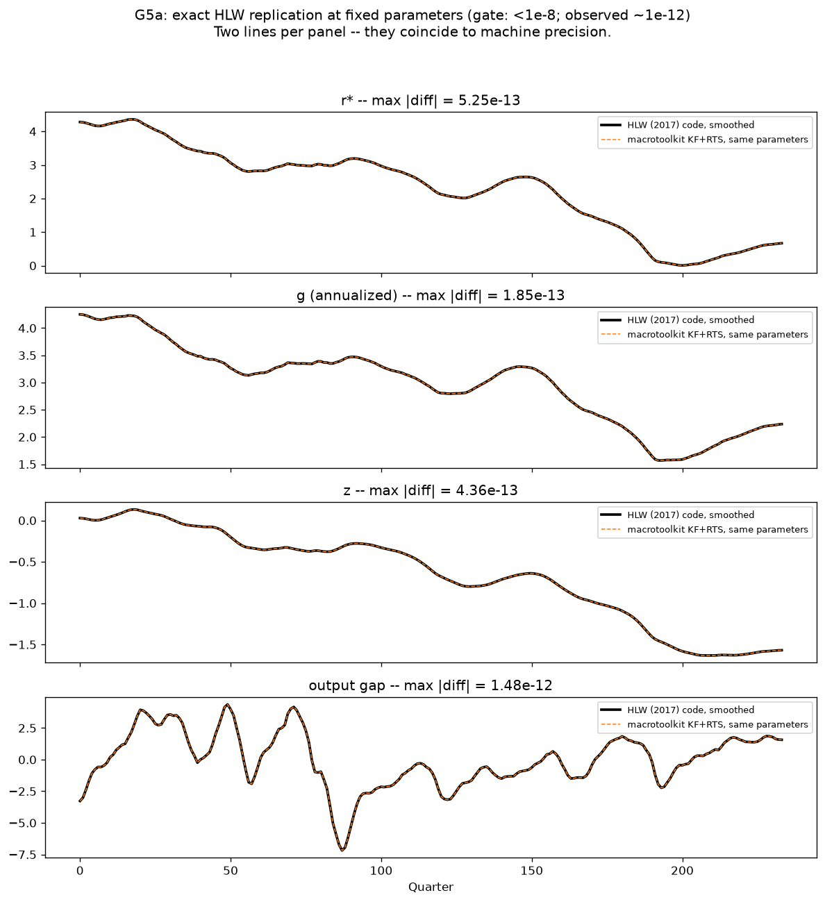
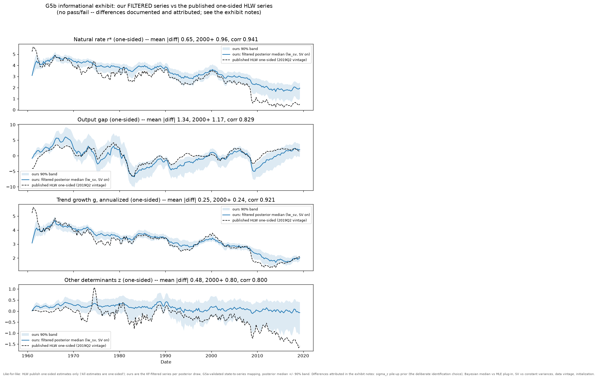
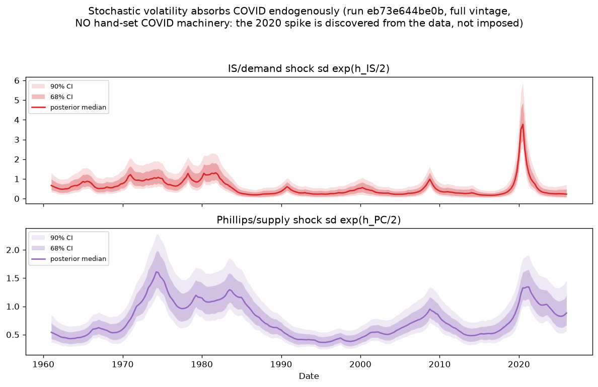

# macrotoolkit

An open-source Python + Stan toolkit for estimating flexible Bayesian
state-space macro models with NUTS — driven end-to-end by declarative YAML
specs: CSV in → rendered Stan program → CmdStanPy estimation → immutable,
hash-identified run store → simulation smoother → trend-cycle plots, IRFs,
fan charts, historical decompositions → one self-contained HTML report.
The long-run vision (dynamic factor models, VAR-SV, UC/star-variable
families, a front-end for economists who never touch Stan) is in
[VISION.md](VISION.md); the engineering doctrine that binds every family is
in [ENGINEERING.md](ENGINEERING.md).

**Status**: the v1 vertical slice — Laubach–Williams with stochastic
volatility (`lw_sv`), spec in [lw-sv-spec.md](lw-sv-spec.md) — is complete
through stage S5. It is deliberately a *dry run of the general framework*:
exact HLW replication is not a goal (see the G5b exhibit below); the value
is the validated shared machinery the next family
(UCSV — see [docs/kf-capability-matrix.md](docs/kf-capability-matrix.md))
plugs into.

## Validation ladder (all gates green)

Every family climbs the same ladder (ENGINEERING.md); `lw_sv`'s results:

| Gate | What it proves | Result |
|---|---|---|
| G1 | Stan KF ≡ Python KF mirror, 50 prior points, 3 filter paths | max diff ~5.5e-12 (gate 1e-8) |
| G2 | Parameter recovery, 20 simulated datasets | pooled 90% coverage in band, no σ_g/σ_z bias |
| G3 | SBC, no-SV variant, 200 pre-registered replications | χ² p ∈ [0.073, 0.735] on all 10 params |
| G4 | SBC, full-SV variant, 100 pre-registered replications | χ² p ∈ [0.067, 0.978] on all 12 ranked quantities; 8/150,000 divergences |
| G5a | Exact HLW replication at fixed parameters | ~1e-12 vs the HLW (2017) oracle |
| G6 | Historical-decomposition reconstruction identity | exact to 1e-6 per period per draw |
| G5b | *(informational exhibit, not a gate)* filtered vs published one-sided HLW | differences measured + attributed (below) |

## Exhibits

### G5a — the external credibility exhibit

Our KF + RTS smoother, fixed at the HLW (2017) MLE parameters and exact
initial conditions, against HLW's own code's smoothed output: the two
lines coincide to machine precision (max |diff| ~1e-12, stamped per
panel).



### G5b — filtered vs published one-sided HLW (informational)

HLW publish one-sided estimates only ("All estimates are one-sided"), so
the like-for-like comparison is our FILTERED posterior series against
their published series. **No pass/fail** — a gate you'd pass by tuning
priors toward a target validates nothing. Measured on the reference run:
r* correlation 0.941; the final-period r* difference (+1.44) decomposes
via r* = g + z into **+1.51 from z and −0.07 from g** — the gap sits
exactly where the deliberate σ_z pile-up identification prior acts, and
trend growth g essentially matches. Full attribution (five documented
causes) in
[docs/exhibits/g5b_filtered_vs_published.md](docs/exhibits/g5b_filtered_vs_published.md).



### Stochastic volatility absorbs COVID endogenously

The full-vintage run (through 2026Q1) carries **no hand-set COVID
machinery**; the SV block discovers it from the data — the four largest
IS-shock volatility medians land in exactly 2020Q1–Q4 (peak 3.77), the
Bayesian counterpart of HLW's hand-set κ variance scaling:



### Prior sensitivity: the mandated σ_g/σ_z sweep

The two pile-up priors do deliberate identification work (they replace
HLW's median-unbiased-estimator machinery), so their sensitivity is
documented by a reusable tool, not a notebook:
`mtk sweep examples/us_lw_sv/sweep_sigma_g_z.yaml` runs
halved/doubled prior scales as ordinary immutable runs and writes one
comparison report with posterior tables, **prior→posterior contraction**
readouts, and the headline r*/gap series overlaid across cells.

Results (5 cells, all 0 divergences; full record in DECISIONS.md
2026-09-03): the σ_g/σ_z posteriors scale near-proportionally with their
prior scales (σ_g median 0.036/0.068/0.109 under prior sd
0.015/0.03/0.06; σ_z median 0.027/0.054/0.115 under 0.04/0.08/0.16) with
contraction of only ~0.04–0.14 — the data contribute little information
about these scales, which is precisely the pile-up problem the priors
exist to resolve, now measured rather than asserted. And the G5b
attribution cross-checks monotonically: the filtered final-period r* gap
to the published series is +1.54 / +1.44 / +1.16 under the tightened /
default / doubled σ_z prior (final z: +0.02 / −0.07 / −0.35).

## Quickstart

```bash
# environment (fresh container recipe -- see HANDOFF.md for details)
uv tool install pytest --with cmdstanpy --with numba --with arviz \
  --with pydantic --with jinja2 --with matplotlib --with pyyaml \
  --with pandas --with click --with h5netcdf --with openpyxl \
  --with-editable .
python -m cmdstanpy.install_cmdstan --dir ~/.cmdstan --version 2.36.0

# estimate, report, sweep
mtk run examples/us_lw_sv/spec_sv.yaml        # ~40-80 min, immutable runs/<hash12>/
mtk report <hash12>                           # self-contained report.html
mtk sweep examples/us_lw_sv/sweep_sigma_g_z.yaml

# tests (fast suite; slow gates run with -m slow)
pytest -m "not slow"
```

A tracked, draw-thinned copy of both reference runs lives in
[runs-archive/](runs-archive/README.md) so a fresh checkout can exercise
the whole output layer without sampling first (development fixtures —
regenerate for publication numbers).

## Adding a model family

Mechanically true since S4.5 (registry contract,
`specs/schema/FAMILY_REGISTRY`): a family = Stan template + spec-schema
fragment + a `macrotoolkit/families/<family>.py` numerics module (named
state metadata with explicit time offsets, the endogenous-lag feedback
map, prior sampler, builders) + one registry entry + a validation suite
instantiated from the generic harnesses (the SBC engine in
`tests/sbc_harness.py` takes a design in and returns rank statistics).
The generic simulate/IRF/HD engine, run store, report, sweep tool, and
prior-predictive check pick the family up automatically. Family #2 is
UCSV; the one real KF extension it needs (time-varying state innovation
covariance Q_t) is scoped in
[docs/kf-capability-matrix.md](docs/kf-capability-matrix.md).

## Repository map

- `specs/schema/` — the spec spine: Pydantic schema + the family registry
- `stan/` — shared Stan functions library + per-family Jinja templates
- `src/macrotoolkit/` — data → render → run store → smoother → engine →
  results → plots → report → CLI (+ sweep, G5b exhibit)
- `tests/` — gates G1–G6 as pytest suites (generic SBC harness included)
- `examples/us_lw_sv/` — the worked US example (specs, data, run records)
- `DECISIONS.md` — every judgment call, dated, newest first
- `HANDOFF.md` — the current stage-end handoff
