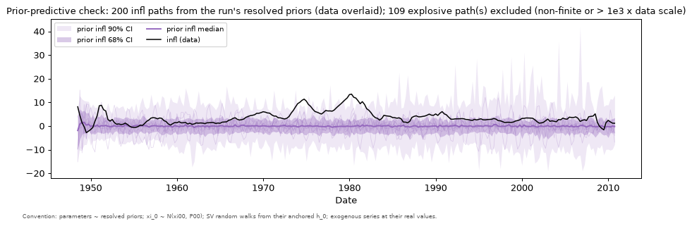
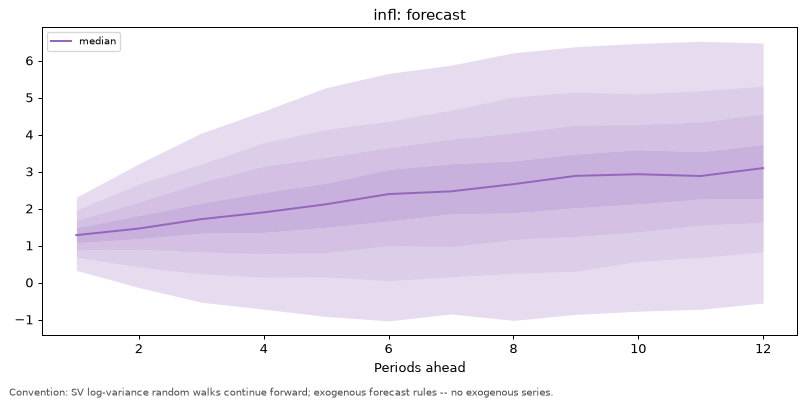

# Chapter 1 — Linear regression models

*Handbook Chapter 1: a Bayesian approach to the linear regression model
(§2), Gibbs sampling for it (§3) with the AR(2) for US inflation
(`example1.m`), forecasting (`example2.m`), serially correlated errors
(`example3.m`), convergence (`example4.m`, `example5.m`), and the marginal
likelihood (§5, `example6.m`).*

Specs: `examples/handbook/ch1_ar2`, `examples/handbook/ch1_ar2_ar1err`.
Data: `examples/handbook/data/ch1_inflation.csv` — US CPI inflation,
quarterly, 1948Q1–2010Q4, converted from the handbook's `inflation.xls`.

## 1. The Bayesian regression (handbook §2)

The handbook's three steps — a prior `B ~ N(B₀, Σ₀)`, `σ² ~ IG(T₀, D₀)`;
the Gaussian likelihood; the posterior by Bayes' rule — are the toolkit's
too. What changes is the fourth step. The handbook derives the two
conditional posteriors (`B | σ²` normal, `σ² | B` inverse-gamma) and cycles
through them; the toolkit samples the joint posterior directly. Nothing
about the model changes: the likelihood in (2.2) is exactly what the
Kalman filter returns for a model with no states, and the compiled Stan
program evaluates it — the S8 oracle pins the filter's value to the
closed-form Gaussian regression likelihood at 50 prior draws.

The priors are declared per parameter. The handbook's `B₀ = 0`, `Σ₀ = I`
becomes `au.normal(0, 1)` on each coefficient. Its inverse-gamma on `σ²`
has no counterpart in the toolkit's menu (normal, half-normal, beta):

> **What differs from the handbook.** `σ² ~ IG(T₀ = 1, D₀ = 0.1)` is
> replaced by `σ ~ half-normal(2)` — a weakly informative prior on the
> standard deviation. With 250 observations the likelihood dominates
> either prior; the posterior for `σ` below is what the data say.

## 2. The AR(2) for US inflation (`example1.m`)

    infl_t = c + b1 infl_{t-1} + b2 infl_{t-2} + e_t,   e_t ~ N(0, σ²)

```python
model = au.Model(
    "ch1_ar2", observables=["infl"],
    measurement=["infl = c + b1*infl[-1] + b2*infl[-2] + e"],
    parameters={"c": au.normal(0, 1), "b1": au.normal(0, 1), "b2": au.normal(0, 1),
                "sigma": au.half_normal(2)},
    shocks={"e": au.shock("sigma")},
)
spec = mtk.spec("authored", options=model,
                data={"file": "../data/ch1_inflation.csv", "date_column": "date",
                      "mapping": {"infl": "inflation"}},
                sampler={"chains": 2, "warmup": 300, "sampling": 300, "seed": 20260905},
                outputs={"horizon": 12})
run = mtk.fit(spec)
```

The compiler reports no states (`n = 0`), two regressor columns
(`infl[-1]`, `infl[-2]`, the feedback map) and two pre-sample rows, and the
handbook's lines 5–9 — load, build the constant and the two lags, drop the
first two rows — are done. The intercept is a parameter (grammar E1); the
alternative the handbook's state-space chapter would suggest, a
deterministic state `c = c[-1]` with `init(0, 1)`, gives the same marginal
likelihood with `c` integrated out by the filter rather than sampled
(the E0 oracle).

**Run `3daed38410ce`** (2 chains × 300/300, 110 s including compilation):
fit-time mirror check max |Stan − Python| = 3.6e-12; verdict **WARN** —
max R-hat 1.023, tail ESS 207 — the smoke-run length, read §5.

| | handbook Table 1 (Gibbs, 24,000 burn-in, 1,000 retained) | companion (posterior median, 5th–95th) |
|---|---|---|
| constant `c` | 0.2494 (0.1104, 0.3765) | 0.247 (0.119, 0.360) |
| `b1` | 1.3867 (1.2922, 1.4806) | 1.393 (1.306, 1.471) |
| `b2` | −0.4600 (−0.5532, −0.3709) | −0.462 (−0.543, −0.380) |
| `σ²` | histogram centred near 0.6 (Figure 6) | `σ` 0.771 (0.724, 0.830), i.e. `σ²` ≈ 0.59 |

The two estimators agree to the second decimal on every coefficient, as
they should: same likelihood, near-flat priors relative to it. The
handbook's Figure 6 histograms and the companion's parameter table are
the same object, the marginal posteriors.

Two things the toolkit reports that the handbook does not:

- **The prior-predictive check** (`outputs.figure("prior_predictive")`,
  Figure 1.1). Under `b1, b2 ~ N(0, 1)` the AR(2) is explosive with high
  prior probability: 109 of 200 prior paths were excluded as non-finite or
  larger than 1,000 × the data scale. The handbook's `example1.m` enforces
  stability by *rejecting* draws whose companion matrix has an eigenvalue
  outside the unit circle (line 38); the toolkit does not truncate the
  posterior, and instead makes the prior's implication visible. For this
  series the posterior mass on explosive roots is negligible, so the
  estimates coincide; for a shorter sample they would not, and the
  handbook's truncation and the toolkit's untruncated prior are then two
  different priors.
- **The historical decomposition** (`outputs.figure("hd")`): with one
  shock the bars are trivially the residuals plus the constant, but the
  reconstruction identity is checked (max error 2e-14), and the same
  figure in Chapter 2 becomes the VAR's shock decomposition with no new
  code.



## 3. Forecasting (`example2.m`)

The handbook forecasts by simulation: for each retained draw of `(c, b1,
b2, σ)`, iterate `Ŷ_{t+1} = c + b1 Y_t + b2 Y_{t-1} + σ v*` twelve times
with fresh standard normals (equation 3.12), and plot the percentiles of
the simulated paths (Figure 9). The toolkit's `fan` module does exactly
this: from each posterior draw, simulate forward from the last observed
values with the feedback map supplying the lags; the bands are the
percentiles across draws and simulations.



The median rises from 1.3% toward 3% — the AR(2)'s mean reversion toward
its unconditional mean `c / (1 − b1 − b2) ≈ 3.6%` — with the 90% band
reaching from below −1% to above 6% at 12 quarters, the same funnel as the
handbook's Figure 9. Nothing here is specific to a regression: Chapter 2's
VAR forecast and Chapter 5's SV forecast are the same module.

## 4. Serially correlated errors (`example3.m`)

    infl_t = c + b1 infl_{t-1} + b2 infl_{t-2} + v_t,   v_t = ρ v_{t-1} + e_t

The handbook's Gibbs sampler (Chib 1993) alternates a quasi-differenced
regression for `(c, b1, b2)` given `ρ`, a regression of the residual on
its lag for `ρ`, and the variance. The toolkit needs neither block,
because substituting `v_{t-1} = infl_{t-1} − c − b1 infl_{t-2} − b2
infl_{t-3}` gives the exactly equivalent single equation

    infl = c(1 − ρ) + (b1 + ρ) infl[-1] + (b2 − ρ b1) infl[-2] − ρ b2 infl[-3] + e

whose coefficients are *expressions* in the parameters — legal in the
grammar, which only requires linearity in the series:

```python
measurement=["infl = c*(1 - rho) + (b1 + rho)*infl[-1] + (b2 - rho*b1)*infl[-2] - rho*b2*infl[-3] + e"],
parameters={..., "rho": au.normal(0, 1, lower=-1, upper=1)},
```

> **What differs from the handbook.** The handbook keeps `ρ` in (−1, 1)
> by rejecting draws outside it; here the prior is truncated to (−1, 1),
> which is the same constraint imposed once rather than per sweep. The
> inverse-gamma on `σ²` is again a half-normal on `σ`. One more pre-sample
> row is consumed (`infl[-3]`).

**Run `ecbc32188034`** (2 chains × 300/300, 68 s): mirror check 3.6e-12;
verdict **FAIL** — tail ESS 78 on `ρ` and `kf_loglik`.

| | companion (median, 5th–95th) |
|---|---|
| `c` | 0.87 (0.34, 1.60) |
| `b1` | 0.62 (0.42, 0.83) |
| `b2` | 0.09 (−0.02, 0.20) |
| `ρ` | 0.74 (0.55, 0.90) |
| `σ` | 0.77 (0.72, 0.82) |

The FAIL is the interesting result, and the handbook shows the same
thing from the other side. Its Figure 14 — 500 Gibbs sweeps of this model —
has the chains *jumping* between two configurations: `(b1 ≈ 1.4, ρ ≈ 0)`
and `(b1 ≈ 0.6, ρ ≈ 0.8)`. That is not slow mixing of a unimodal
posterior; the model has two modes. Written as the substituted equation,
it is an AR(3) in inflation with three free coefficients mapped from
`(b1, b2, ρ)` — an autoregressive root can be attributed either to the
regression or to the error, and the data discriminate between the two
attributions only weakly. The companion's chains sat in the `ρ ≈ 0.74`
mode; the handbook's 25,000-sweep run (its Figure 17) settles mostly in
the other. Neither is wrong about the *reduced-form* dynamics — the
implied AR(3) coefficients `(b1 + ρ, b2 − ρ b1, −ρ b2)` are similar in
both — and both estimators' diagnostics flag the problem correctly: the
handbook's recursive means drift (Figure 15), the toolkit's tail ESS
collapses. The modelling answer is the same in either tool: a prior that
distinguishes the two attributions (a tighter prior on `ρ`, say) or the
decision that the reduced-form AR(3) is what one wanted.

The forecast fan for this model (`figures/ch1_ar2_ar1err/fan_infl.png`)
is the handbook's Figure 13.

## 5. Convergence (`example4.m`, `example5.m`)

The handbook's convergence toolkit — the plotted sequence of draws, the
recursive mean, the autocorrelation function, Geweke's split-sample
statistic — answers the question "have the Gibbs draws converged to the
marginal posterior". Part 0 §4 describes the toolkit's verdict. On this
chapter's two runs:

- `ch1_ar2` at 2 × 300/300: R-hat up to 1.023, bulk ESS 337–350, tail ESS
  207 → WARN. The posterior medians already match the handbook's 24,000-
  burn-in results to two decimals; the WARN is about the *precision of the
  tails*, and a 4 × 1,000/1,000 run clears it (this is the run session's
  publication-length setting).
- `ch1_ar2_ar1err`: tail ESS 78 → FAIL, for the bimodality reason in §4.
  Longer chains alone do not fix a model with two modes — they make the
  verdict PASS while the posterior stays bimodal, which is why the states
  figure and the parameter table should be read together, not the verdict
  alone.

The correspondence between the two toolkits is not one-to-one. Geweke's
statistic compares the mean of the first 10% of a chain with the last
50%; R-hat compares chains with each other. Autocorrelation functions
are summarised by the effective sample size. Divergences and E-BFMI have
no Gibbs counterpart at all — they are properties of the Hamiltonian
sampler and are the diagnostics that catch the geometry problems Gibbs
silently mixes through.

## 6. The marginal likelihood (§5, `example6.m`) — gap

The handbook computes the marginal likelihood of the regression by Chib's
method from the Gibbs output and uses it to compare models. The toolkit
does not compute marginal likelihoods (extension E8: bridge sampling
over the posterior draws, and leave-one-out cross-validation as the
predictive alternative). Until it does, model comparison in this
companion is by the prior-predictive and posterior-predictive figures,
the forecast fans, and the sweeps — not by Bayes factors. The gap
recurs in Chapters 2 (VAR marginal likelihood) and 5 (Gelfand–Dey).

## Summary

| Handbook | Companion | Status |
|---|---|---|
| ex. 1 AR(2), Gibbs | `ch1_ar2`, run `3daed38410ce`; Table 1 reproduced to two decimals | runs |
| ex. 2 forecast by simulation | the `fan` module | runs |
| ex. 3 AR(1) errors, Chib's blocks | `ch1_ar2_ar1err`, the exact substituted equation; bimodality diagnosed by both tools | runs |
| ex. 4–5 convergence | the diagnostics verdict (Part 0 §4) | — |
| ex. 6 marginal likelihood | — | gap (E8) |
