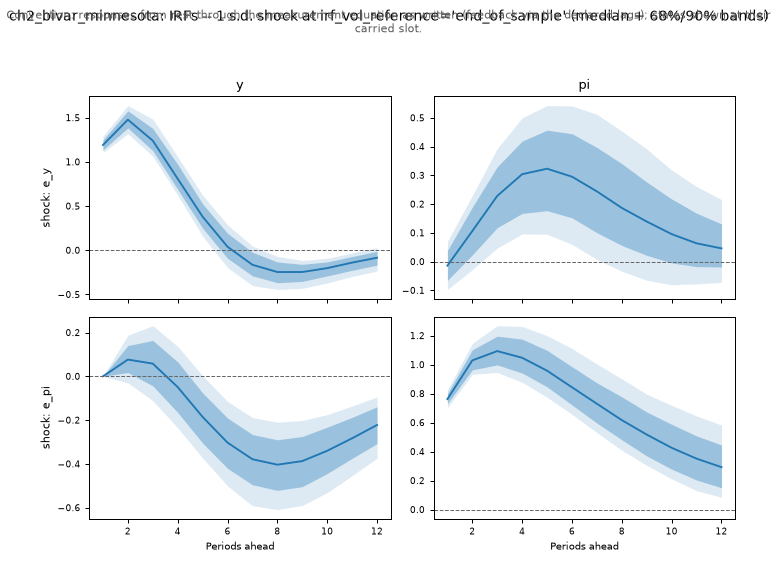

# Chapter 2 — Vector autoregressions

*Handbook Chapter 2: the conditional posteriors and the Gibbs sampler for
a VAR (§1, `example1.m`), the Minnesota prior (§2), the normal–inverse-
Wishart prior (§3, `example2.m`), steady-state priors (§4, `example3.m`),
dummy observations (§5, `example4.m`), structural VARs and sign
restrictions (§6, `example5–7.m`), conditional forecasting (§7,
`example8.m`), and the marginal likelihood (§9, `example9.m`).*

Specs: `ch2_bivar_minnesota`, `ch2_var4_monthly_cholesky`,
`ch2_steady_state`, `ch2_signs_11var`, `ch2_conditional`. Data: the
handbook's `datain.xls` (US GDP growth and inflation, 1948Q1–2010Q4),
`dataUS.xls` (monthly, 2007m1–2010m12) and `usdata1.xls` (11 series,
1971Q1–2010Q4).

## 1. A VAR as a system of equations, and what changes (handbook §1)

The handbook's VAR is

    Y_t = c + B₁ Y_{t−1} + ... + B_p Y_{t−p} + v_t,   v_t ~ N(0, Σ),

with a Gibbs sampler that draws `vec(B)` from its normal conditional and
`Σ` from an inverse-Wishart (§1). The toolkit's grammar has one
structural rule that a VAR at first sight violates: **each measurement
equation carries exactly one shock, and the shocks are orthogonal** — no
full `Σ`. The way through is the fact that any covariance matrix is the
covariance of a triangular system. Order the variables, and write

    y₁ = c₁ + (lags) + e₁
    y₂ = c₂ + a0₂₁ y₁ + (lags) + e₂
    y₃ = c₃ + a0₃₁ y₁ + a0₃₂ y₂ + (lags) + e₃   ...

with orthogonal `e_i ~ N(0, σ_i²)`. The contemporaneous `y_j` on the
right-hand side is substituted by its own equation (grammar extension
E5, stage S8 — the same acyclic substitution the compiler already did for
states), so the reduced form has `Σ = M diag(σ²) M′` with `M` unit lower
triangular: the Cholesky factor of `Σ` *is* the structural impact matrix.
`au.var(name, observables, p, priors=...)` writes this system.

Two consequences run through the chapter. The engine's structural
impulse responses under the ordering are the handbook's Cholesky IRFs
(§3), with no separate identification step. And the priors sit on the
*recursive-form* coefficients — the same object as the handbook's
reduced-form coefficients for the first equation, and related to them
by the `a0` combinations for the later ones.

> **What differs from the handbook, throughout Chapter 2.** The
> inverse-Wishart prior on `Σ` is replaced by `half-normal` priors on the
> orthogonal shock scales `σ_i` and `N(0, a0_sd²)` priors on the
> contemporaneous coefficients. The Minnesota prior is placed on the
> recursive-form coefficients (`macrotoolkit/authoring/var.py` states the
> correspondence: conditional on `Σ`, the handbook's normal conditional
> for `vec(B)` is exactly the posterior these independent normal priors
> imply for the reduced form). The sampler differs in kind — NUTS over
> all coefficients and scales jointly, with the Kalman filter running at
> `n = 0` states so the likelihood is the Gaussian VAR likelihood.

## 2. The Minnesota prior (handbook §2, `example1.m`)

The handbook's example is a VAR(2) in GDP growth and inflation with
Litterman's prior: own first lag centred at 1, everything else at 0, prior
variances `(λ₁/k^{λ₃})²` on own lags, `(s_i λ₁ λ₂ / (s_j k^{λ₃}))²` on cross
lags and `(s_i λ₄)²` on constants, `λ₁..₄ = 1`, `s_i` from AR(1)
regressions; `Σ ~ IW(I, N+1)`; a 12-quarter forecast.

```python
df = pd.read_csv("ch2_datain.csv").rename(columns={"gdp_growth": "y", "inflation": "pi"})
priors = au.minnesota_priors(df, ["y", "pi"], 2, lambda1=1, lambda2=1, lambda3=1, lambda4=1, own_mean=1)
model = au.var("ch2_bivar_minnesota", ["y", "pi"], 2, priors=priors)
```

`au.minnesota_priors` reproduces the handbook's `H` matrix entry for
entry (pinned in `tests/test_s8_var.py`).

**Run `a620305f7c6e`** (2 × 300/300, 86 s): mirror check 1.8e-12; verdict
WARN (R-hat 1.020, ESS ≈ 300).

| | median (5th–95th) | | median (5th–95th) |
|---|---|---|---|
| `c_y` | 1.13 (0.85, 1.40) | `c_pi` | 0.09 (−0.10, 0.28) |
| `b_y_y_1` | 1.23 (1.16, 1.33) | `b_pi_pi_1` | 1.36 (1.25, 1.47) |
| `b_y_y_2` | −0.49 (−0.60, −0.41) | `b_pi_pi_2` | −0.42 (−0.53, −0.32) |
| `b_y_pi_1` | 0.10 (−0.04, 0.24) | `b_pi_y_1` | 0.12 (0.01, 0.23) |
| `b_y_pi_2` | −0.19 (−0.33, −0.05) | `b_pi_y_2` | −0.07 (−0.14, 0.00) |
| `sigma_y` | 1.19 (1.11, 1.29) | `sigma_pi` | 0.76 (0.70, 0.83) |
| `a0_pi_y` | −0.01 (−0.08, 0.06) | | |

The contemporaneous coefficient `a0_pi_y ≈ 0` says the two innovations are
nearly uncorrelated in this sample — the recursive form's `Σ` is close to
diagonal, and the ordering does not matter for the responses.



A GDP-growth innovation (Figure 2.1, top row) raises growth by 1.5 points
at its peak two quarters out and dies away by six quarters, with a small
delayed pass-through to inflation (peak +0.3 at five quarters); an
inflation innovation is persistent (1.1 → 0.3 over twelve quarters) and
lowers growth by 0.4 points after two years. The forecast fans
(`figures/ch2_bivar_minnesota/fan_y.png`, `fan_pi.png`) are the
handbook's Figure 4 — the same simulation from each posterior draw as
Chapter 1 §3, now with the feedback map supplying both variables' lags.

## 3. The normal–inverse-Wishart prior and Cholesky IRFs (handbook §3, `example2.m`)

The handbook's second example is a monthly VAR(2) in the federal funds
rate, the 10-year yield, unemployment and inflation over 2007–2010 (46
observations), with a tight prior (`λ₁ = 0.1`, `λ₃ = 0.05`, own first
lag 0.95) and the funds-rate equation's cross-lag coefficients shrunk to
zero (prior variance 10⁻⁹); impulse responses to a bond-yield shock
through `A₀ = chol(Σ)`.

```python
priors = au.minnesota_priors(df, obs, 2, lambda1=0.1, lambda2=1, lambda3=0.05, lambda4=1, own_mean=0.95)
for k in (1, 2):
    for other in ("bond10y", "unemployment", "inflation"):
        priors[f"b_ffr_{other}_{k}"] = au.normal(0.0, 1e-9 ** 0.5)      # the handbook's "close to zero"
model = au.var("ch2_var4_monthly_cholesky", obs, 2, priors=priors)
```

The engine's structural IRFs under the ordering `ffr → bond10y →
unemployment → inflation` are the handbook's Cholesky responses; the
`e_bond10y` shock is its yield shock.

**Run `7247575d7872`** (2 × 300/300, 165 s): mirror check 7.0e-8 in
absolute terms (5e-12 relative — the flat-ish priors put `|loglik|`
near 10⁴, where the gate's relative form applies); verdict WARN. Impact
medians of the bond-yield shock: ffr +0.000 (the ordering), bond10y
+0.310, unemployment +0.045, inflation +0.074. With 46 observations the
posterior is prior-dominated, exactly as in the handbook, and the smoke
run saturated the tree depth on 592 iterations — the diagnostics say what
the handbook's 46-observation exercise cannot: this posterior is hard to
sample, because the tight prior on 40 coefficients and the near-unit
own-lag means make it a narrow ridge.

> **What differs.** The normal–inverse-Wishart's Kronecker-structured
> prior covariance is the independent-normal Minnesota prior here (the
> `H` matrix of §2 rather than `Σ ⊗ ...`); the 10⁻⁹ shrinkage is applied
> by name to the same coefficients.

## 4. Steady-state priors (handbook §4, `example3.m`)

Villani's VAR in deviations from long-run means,

    (Y_t − μ) = B₁ (Y_{t−1} − μ) + B₂ (Y_{t−2} − μ) + v_t,

with a tight prior `μ ~ N((1, 1), 0.001 I)` and a separate Gibbs block for
`μ`, is in the toolkit a VAR whose long-run means are **shock-free
constant states** (E0): `au.var(..., intercept="steady_state",
steady_state_init={"y": au.init(1.0, 0.001**0.5), ...})`. The intercept
of each recursive equation is Villani's identity written with parameter-
expression coefficients on the two states, and the Kalman filter
integrates `μ` out exactly — the S8 oracle checks the filter's likelihood
against the closed-form marginal over `μ`. No new machinery: the
handbook's Gibbs block for `μ` is the filter.

**Run `fc2f0c3c4319`** (2 × 300/300, 105 s): mirror check 1.8e-12; verdict
WARN. The smoothed `μ` paths are flat lines at the posterior of the
long-run means, 1.01 for growth and 1.00 for inflation — the prior
dominates, as it is meant to with a variance of 0.001; `sigma_y` 1.27,
`sigma_pi` 0.76. The 10-year forecast fan (`outputs.horizon: 40`) is the
handbook's Figure 12: the forecasts converge to the long-run means the
prior asserts.

## 5. Dummy observations (handbook §5, `example4.m`) — a stated approximation

Banbura, Giannone and Reichlin's implementation adds artificial
observations to the data so that OLS on the augmented sample returns the
prior's posterior: Minnesota dummies, sum-of-coefficients dummies (a
prior that the VAR has a unit root in each variable's own lags) and a
co-persistence dummy. The Minnesota part is what §2 already expresses.
The sum-of-coefficients and co-persistence dummies are **not**
independent normal priors on the coefficients — they are priors on linear
*combinations* of coefficients — and the toolkit's per-parameter prior
menu cannot state them. The companion's 11-variable example in §6 uses
the Minnesota normals in their place and says so; a prior on a
combination of coefficients is a small grammar addition if a model needs
it (declare the combination as a parameter and the coefficients as
expressions in it), not a filter change.

## 6. Structural VARs and sign restrictions (handbook §6, `example5–7.m`)

The handbook's 11-variable VAR(2) identifies a monetary-policy shock by
signs on impact — the funds rate up; GDP growth, inflation, consumption
growth, investment and M2 growth down; unemployment up — by drawing
orthogonal rotations `Q` of `chol(Σ)` (via the QR of a Gaussian matrix)
until a column satisfies the pattern. `example6.m` scans all columns of
each candidate; `example7.m` keeps the rotation closest to the median of
100 accepted ones.

In the toolkit the VAR is the recursive form with Minnesota priors, and
the sign restrictions are a **post-processor over the posterior draws of
the impulse responses**: `postprocess.sign_restricted_irfs` rotates each
draw's impact matrix (the Haar-distributed QR with the handbook's
`getqr` sign convention, pinned against the handbook's construction),
searches the columns and their sign flips for the pattern, and returns
the accepted responses with bands; `closest_to_median=100` reproduces
`example7.m`.

```python
from macrotoolkit.postprocess import SignRestriction, irf_array_from_draws, sign_restricted_irfs
arr, targets, shocks = irf_array_from_draws(run.outputs().compute("irf"), targets=obs)
restr = [SignRestriction("mp", v, s, (0,)) for v, s in
         (("ffr", +1), ("gdp_growth", -1), ("cpi_inflation", -1), ("pce_growth", -1),
          ("unemployment", +1), ("investment", -1), ("m2", -1))]
sr = sign_restricted_irfs(arr, restr, targets, np.random.default_rng(20260905), max_tries=2000)
```

The 11-variable VAR has 319 sampled parameters; its smoke run timed out
at S8's session length and is one of the companion's run sessions
(`09-run-sessions.md`). The post-processor's own tests pin the mechanism
on synthetic draws: `Σ` is invariant under every retained rotation, the
restrictions hold in every accepted column, and contradictory
restrictions reject everything.

> **What differs.** The dummy-observation prior (`λ = 1`, `τ = 10λ`) is
> replaced by the independent-normal Minnesota prior at `λ₁..₄ = 1` (§5).
> The sampler is reduced for the smoke run.

## 7. Conditional forecasting (handbook §7, `example8.m`)

Waggoner and Zha's conditional forecast holds a variable on a chosen
path and asks what the other variables do: the structural shocks over
the horizon are restricted to `N(R′(RR′)⁺ r, I − R′(RR′)⁺R)`, with `R`
built from the impulse responses and `r` from the gap between the
conditioning path and the unconditional forecast. The handbook fits the
VAR with a flat prior and appends the conditional path to the data in
each Gibbs sweep.

`postprocess.conditional_forecast_for_run` computes the same restricted-
shock distribution from the engine's IRFs and unconditional forecast for
every posterior draw (through the SVD of `R` rather than `(RR′)⁺`, the
same quantities to 1e-10). Inflation held at 1% for three quarters:

**Run `d92813ddfb30`** (the example-1 model under the example-8 name, 2 ×
300/300, 96 s): the conditioned inflation path reproduces `(1, 1, 1)` to
1.5e-7; the median GDP-growth path is **2.88, 3.14, 3.48** against the
unconditional **2.84, 3.19, 3.57** — holding inflation slightly above its
unconditional forecast lifts growth a touch on impact and shaves it
thereafter, through the `b_y_pi` coefficients of §2. The handbook's
Figure 23 is the same exercise.

> **What differs.** The flat prior of the handbook puts no mass on
> stationary draws, and the fast tier's decomposition-identity gate
> needs stationary prior points, so the example uses the Minnesota
> priors of §2. There is no data augmentation: the posterior conditions
> on the observed sample only. The handbook's augmentation feeds the
> conditional path back into the VAR posterior — a Gibbs device the
> marginal-likelihood estimator does not replicate; with missing-
> observation support (E7) the same conditional forecast is a smoothing
> problem on a partially observed future row.

## 8. The marginal likelihood (handbook §9, `example9.m`) — gap

Extension E8, as in Chapter 1 §6.

## Summary

| Handbook | Companion | Status |
|---|---|---|
| §1–2 Minnesota bivariate VAR, forecast | `ch2_bivar_minnesota`, run `a620305f7c6e` | runs |
| §3 NIW prior, Cholesky IRFs | `ch2_var4_monthly_cholesky`, run `7247575d7872` | runs |
| §4 steady-state prior | `ch2_steady_state`, run `fc2f0c3c4319` | runs |
| §5 dummy observations | Minnesota part; sum-of-coefficients / co-persistence stated as not expressible | approximation |
| §6 sign restrictions | `ch2_signs_11var` + the post-processor | runs (run session) |
| §7 conditional forecasts | `ch2_conditional`, run `d92813ddfb30` + the post-processor | runs |
| §9 marginal likelihood | — | gap (E8) |
