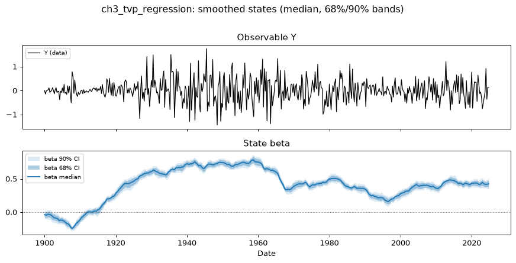
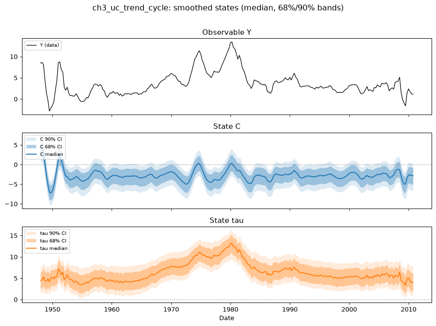

# Chapter 3 — State-space models

*Handbook Chapter 3: examples of state-space models (§2: the TVP
regression, the unobserved-components trend–cycle model, the dynamic
factor model), the Gibbs algorithm for them (§3), the Kalman filter and
the Carter–Kohn algorithm in MATLAB (§4–5, `example1.m`, `example2.m`),
the time-varying-parameter VAR (§6, `example3.m`), the factor-augmented
VAR (§7, `example4.m`), and the mixed-frequency VAR (§8, `example5.m`).*

Specs: `ch3_tvp_regression`, `ch3_uc_trend_cycle`, `ch3_tvp_var`,
`ch3_dfm_uk_panel`. Data: the handbook's `usdata.xls` (US GDP growth,
CPI inflation, federal funds rate), the 40-series UK panel with its
transformation index, and example 1's artificial DGP simulated once at a
recorded seed.

## 1. Writing state-space models as equations (handbook §2)

The handbook's general form is

    Y_t = H β_t + A z_t + e_t,        β_t = μ + F β_{t-1} + v_t,

and its three examples are three ways of filling `H`, `F`, `μ` by hand.
In the toolkit the equations are written in named series and the
compiler fills the matrices; the state vector, including the extra slots
an AR(2) needs, is derived. The three examples:

**The TVP regression** (2.4)–(2.5), `Y_t = c_t + B_t X_t + e_t` with
random-walk coefficients:

```python
au.Model("tvp_regression", observables=["Y"], exogenous=["X"],
    measurement=["Y = c + beta*X + e"],
    transition=["c = c[-1] + v1", "beta = beta[-1] + v2"], ...)
```

`beta*X` is a state multiplied by data — the handbook's `H = (1, X_t)` is
time-varying. This is grammar extension E4 (stage S9): the product
compiles to a data-dependent measurement loading `Z_t`, and the shared
Kalman filter takes a `Z_t` path exactly as it takes `R_t` and `Q_t`
paths.

**The unobserved-components model** (2.6)–(2.7), `Y_t = C_t + τ_t` with
a random-walk trend and an AR(2) cycle with a constant:

```python
au.Model("uc", observables=["Y"], measurement=["Y = C + tau"],
    transition=["C = c0 + a1*C[-1] + a2*C[-2] + e1", "tau = tau[-1] + e2"], ...)
```

The measurement equation has **no shock** — the handbook's "observation
equation has no error term" — which is extension E3 (a singular `R`,
allowed when the row loads stochastic states), and the cycle's constant
is a transition drift (E1, an implicit unit state). The compiled matrices
equal the hand-built (2.6)–(2.7) construction bit for bit
(`tests/test_s8_grammar.py`).

**The dynamic factor model** (2.8)–(2.9), `Y_it = B_i F_t + e_it` with an
AR(2) factor: `N` measurement equations `Y_i = l_i*F + e_i` and one
transition equation `F = c + r1*F[-1] + r2*F[-2] + v`. Identification —
the handbook fixes the scale by the prior; §6 below fixes it by unit
loadings.

> **What differs from the handbook.** The handbook's `Q` in (2.7) allows
> a covariance between the trend and cycle shocks (`Q_{1,2}`); the
> grammar's state shocks are orthogonal (a shared or correlated state
> shock is outside it). The UC model here is the orthogonal-shock case,
> which is the one the handbook actually discusses.

## 2. Estimation (handbook §3): the marginal likelihood instead of the Gibbs cycle

The handbook's algorithm (§3) conditions on the states to turn every
equation into a Chapter 1 regression, then draws the states given the
parameters by Carter–Kohn. The toolkit never conditions on the states: the
Kalman filter gives the likelihood of the parameters with the states
integrated out, NUTS samples the parameters, and the Durbin–Koopman
smoother draws the state paths afterwards, once per posterior draw
(Part 0 §3). For the handbook's examples the difference in *estimator*
is invisible in the results and visible in the diagnostics: no
conditional blocks, no stability rejection inside the loop, and an
effective-sample-size verdict instead of a burn-in judged by eye.

## 3. The Kalman filter and Carter–Kohn (handbook §4–5, `example1.m`, `example2.m`)

The handbook's `example1.m` simulates `Y_t = β_t X_t + e_t`, `β_t =
β_{t-1} + v_t` with `R = 0.01`, `Q = 0.001`, `β_0 = 0`, `P_0 = 1`, `T =
500`, and codes the filter line by line; `example2.m` adds the backward
draw. Two facts tie the handbook's code to the toolkit's:

- **The filters agree.** The companion's test suite runs the handbook's
  own loop from `example1.m` on the simulated data and compares the
  filtered `β_{t|t}` with `smoother.py`'s: they agree to 1e-10
  (`tests/test_s9_grammar.py`). The toolkit's filter is also mirrored in
  Stan to ~1e-12 (the validation ladder's rung 1), so the program the
  authored model compiles to computes the same numbers as the handbook's
  MATLAB.
- **The smoother plays Carter–Kohn's role.** Carter–Kohn draws `β_{1:T}`
  from its conditional given the parameters by one backward pass through
  the filter's output; the DK simulation smoother produces the same joint
  draw by simulating a "plus" path and smoothing twice. Both are exact.

The estimated model — the handbook fixes `R` and `Q`; here both are
estimated —

```python
au.Model("ch3_tvp_regression", observables=["Y"], exogenous=["X"],
    measurement=["Y = beta*X + e"], transition=["beta = beta[-1] + eta"],
    parameters={"s_e": au.half_normal(0.2), "s_eta": au.half_normal(0.1)},
    shocks={"e": au.shock("s_e"), "eta": au.shock("s_eta")},
    initial_state={"beta": au.init(0.0, 1.0)})
```

**Run `f48f15521246`** (2 × 300/300, 60 s): mirror check 8.5e-14; verdict
WARN (tail ESS 207).

| | true (the DGP) | companion (median, 5th–95th) |
|---|---|---|
| `s_e = √R` | 0.100 | 0.099 (0.093, 0.105) |
| `s_eta = √Q` | 0.032 | 0.028 (0.023, 0.033) |

The two variances the handbook holds fixed are recovered from one
simulated sample. The smoothed `β_t` (Figure 3.1) contains the true path
inside its 90% band at 91.0% of periods; the smoothed median's RMSE
against the truth is 0.037, against 0.052 for the handbook's *filtered*
estimate at the true parameters — the smoother uses the whole sample.



> **What differs from the handbook.** `R` and `Q` are estimated with
> half-normal priors rather than fixed at their true values; the initial
> condition `(β_0, P_0) = (0, 1)` is the handbook's. The DGP is simulated
> once at seed 20260905 (`make_data.py`) rather than afresh on every run,
> so the example is reproducible.

## 4. The unobserved-components trend–cycle model (handbook §2, (2.6)–(2.7))

The handbook writes the model down but does not estimate it; the
companion estimates it on the Chapter 1 inflation series (trend inflation
plus an AR(2) cycle), with priors `c0 ~ N(0, 0.5)`, `a1 ~ N(1, 0.3)`,
`a2 ~ N(−0.3, 0.3)`, `s1 ~ half-normal(1)`, `s2 ~ half-normal(0.5)` and
initial conditions `C_0 ~ N(0, 2²)`, `τ_0 ~ N(Y_1, 5²)`.

**Run `32ff691ff037`** (4 × 500/500, 143 s): mirror check 2.3e-13; verdict
**PASS** (no divergences, R-hat ≤ 1.008, bulk ESS ≥ 440).

| | median (5th–95th) |
|---|---|
| `a1` | 1.53 (1.40, 1.64) |
| `a2` | −0.72 (−0.83, −0.55) |
| `c0` | −0.50 (−0.96, 0.00) |
| `s1` (cycle shock) | 0.43 (0.23, 0.61) |
| `s2` (trend shock) | 0.54 (0.39, 0.67) |



The cycle's roots are complex (`a1² + 4a2 < 0`) with modulus √0.72 ≈
0.85 — a damped oscillation of period 2π/arccos(a1/(2√−a2)) ≈ 14 quarters —
and the trend carries the level: it rises to about 13% at the 1980 peak
and returns to 2–4% after 1990. One feature deserves the reader's
attention because it is a property of the model, not of the estimator:
the cycle's constant `c0` and the trend's level are only jointly
identified. With `c0 = −0.5` and `a1 + a2 = 0.82`, the cycle's
unconditional mean is `c0/(1 − a1 − a2) ≈ −2.7`, and the trend sits that
much above inflation on average (Figure 3.2, middle and lower panels).
The likelihood cannot distinguish "cycle centred at −2.7, high trend" from
"cycle centred at zero, lower trend"; the prior on `c0` decides, and a
prior centred tightly at zero would move the level into the trend. This
is the reason the handbook's remark that the decomposition "assumes that
`Y_t` decomposes exactly into the two components" matters: exactness
constrains the sum, not the split.

The historical decomposition (`figures/ch3_uc_trend_cycle/hd_Y.png`)
splits inflation into the contributions of the cycle shock, the trend
shock and the initial condition; the reconstruction identity holds to
8e-15.

## 5. The time-varying-parameter VAR (handbook §6, `example3.m`)

The handbook's TVP-VAR(2) for GDP growth, CPI inflation and the federal
funds rate lets all 21 coefficients follow random walks with an inverse-
Wishart prior on their covariance `Q`, keeps `Σ` constant, draws the
coefficient paths by Carter–Kohn with a stability rejection, and computes
time-varying impulse responses to a policy shock identified by sign
restrictions at each date.

In the toolkit the model is the recursive VAR of Chapter 2 (E5) with
every coefficient a random-walk state multiplying the lagged observables
(E4) — 21 coefficient states plus the constant `Σ` through the
contemporaneous coefficients:

```python
# built by build_specs.py: au.var(..., tvp=True) expands the 21 random-walk coefficient states
# and the initial conditions from the handbook's 40-quarter pre-sample OLS (beta0, V0)
```

> **What differs from the handbook.** The inverse-Wishart `Q ~ IW(Q₀, T₀)`
> with `Q₀ = V₀ T₀ 3.5e-4` implies a per-coefficient random-walk standard
> deviation of about `0.118 √V₀,ii` ≈ 0.01 for the lag coefficients; it
> is replaced by one `half-normal(0.01)` drift scale per equation. `Σ`'s
> inverse-Wishart by `half-normal(2)` shock scales and `N(0, 1)` on the
> contemporaneous coefficients. The stability rejection is not imposed —
> the filter marginalises the coefficient paths, and explosive posterior
> mass is *reported* by the fast tier's stationarity filter rather than
> truncated. The sign-restricted policy shock is a post-processor over
> the dated IRFs and was not run at the smoke length.

The S9 smoke run (`2ee4bc9e9b98`, 2 × 200/200; the S9 example README)
reached a **FAIL** verdict at that length (tail ESS 52) — 21 states and 27
sampled parameters need a publication-length run, which is one of the run
sessions. What the smoke run already shows is the object of the exercise:
IRFs to the policy shock *conditional on the coefficient state* at
1975Q1, 1995Q1 and 2008Q4 (`outputs.irf_dates`), and the 21 smoothed
coefficient paths. It also shows a modelling issue the handbook's tight
`Q₀` and stability rejection prevent and a looser drift scale exposes: a
per-equation drift scale shared by the intercept and the lag coefficients
lets a random-walk *intercept* absorb a persistent series' innovations
(the funds-rate equation's drift scale was pulled to 0.052 against a 0.01
prior). The record states this rather than tuning it away; a per-
coefficient scale or a fixed drift scale is the modelling response.

Two toolkit rules for TVP outputs, both from the S9 plan: the
coefficient shocks are *structure*, so they are omitted from the impulse-
response and decomposition bars with the reason stated (a bilinear
contribution has no additive decomposition), and the historical
decomposition holds the coefficient path at its drawn values.

## 6. The factor-augmented VAR (handbook §7, `example4.m`)

The handbook's FAVAR extracts three factors from a 40-series UK panel
(first-differenced or differenced per an index file, then standardised),
adds the Bank Rate as an observed factor, identifies the top 3×3 loading
block as the identity, and runs a VAR(2) on (factors, rate) with a
recursive policy shock.

The DFM block is expressible today: 40 measurement equations, the first
three with unit loadings on their own factor, the rest with `N(0, 1)`
loadings on all three, `half-normal(1)` idiosyncratic scales, and the
factors a VAR(2) in the state with orthogonal shocks (`ch3_dfm_uk_panel`;
`m = 40`, `n = 6`). The 40×40 innovation Cholesky per period makes it the
slowest of the Chapter 3 models, and its run is a run session rather
than a smoke run.

> **What differs from the handbook.** The factor VAR's full `Σ` is a
> correlated state shock and is outside the grammar; the factors have
> orthogonal shocks here. The FAVAR's rate block — the rate as an
> observable *inside* the factor VAR — needs the E5 substitution on the
> state side and is a follow-up; the companion's example is the DFM part
> (the handbook's factor extraction and loadings), not the policy-shock
> responses of the handbook's Figure 18. Dates: the handbook gives none;
> the CSV uses a quarterly index ending 2006Q1 as a label.

## 7. The mixed-frequency VAR (handbook §8, `example5.m`) — gap

The handbook's mixed-frequency VAR treats a quarterly series as a monthly
series observed once per quarter, writes the model in state-space form
and draws the missing months by Carter–Kohn. That is exactly a Kalman
filter with **missing observations**, which the shared filter does not
support yet (extension E7: a row-selection step per period in the filter,
the smoother and the shock recovery, in both the Stan and the Python
mirrors, behind a masked G1 path). The capability matrix defers it to the
dynamic-factor-model family that needs it first. When E7 lands, the
mixed-frequency VAR is an authored model with `NaN` rows in the data —
no new grammar — and so is *conditional forecasting by smoothing*
(Chapter 2 §7): a future path is a partially observed row.

## Summary

| Handbook | Companion | Status |
|---|---|---|
| §2 TVP regression; §4–5 filter and Carter–Kohn on it | `ch3_tvp_regression`, run `f48f15521246`; true `√R`, `√Q` recovered; the handbook's filter loop reproduces the toolkit's filtered path to 1e-10 | runs |
| §2 UC trend–cycle | `ch3_uc_trend_cycle`, run `32ff691ff037` (PASS); orthogonal shocks stated | runs |
| §2 DFM | the DFM block of `ch3_dfm_uk_panel` | runs (run session) |
| §6 TVP-VAR | `ch3_tvp_var` (S9), dated IRFs; publication-length run pending | runs |
| §7 FAVAR | DFM block; the rate block a follow-up | partial |
| §8 mixed frequency | — | gap (E7) |
