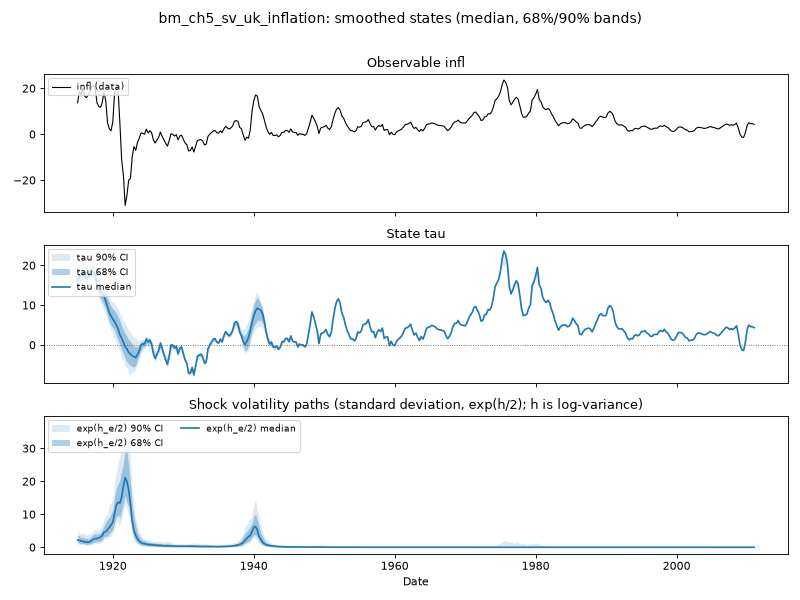

# Chapter 5 — Metropolis–Hastings, stochastic volatility and time-varying parameters

*Handbook Chapter 5: the Metropolis–Hastings algorithm (§2), the random-walk
variant on a nonlinear regression (§3, `example1.m`, `example2.m`) and on
a time-varying-parameter model through the Kalman-filter likelihood
(`example3.m`), the independence variant for a stochastic-volatility
model of UK inflation (§4, `example4.m`) and a TVP-AR(1) with SV
(`example5.m`), the TVP-VAR with SV (§5, `example6.m`), convergence (§6),
the Gelfand–Dey marginal likelihood (§8, `example7.m`); and the
structural, threshold and smooth-transition VARs in the chapter's code
(`SVAR.m`, `thresholdvar.m`, `starVAR.m`).*

Specs: `ch5_tvp_ar1_sv`; the SV model of §3 below; `ch3_tvp_regression`
for `example3.m`. Data: the handbook's `inflation.xlsx` — the UK price
level 1914Q1–2011Q1, annual inflation `100(ln P_t − ln P_{t−4})`
(`examples/handbook/data/ch5_uk_inflation.csv`).

## 1. The Metropolis–Hastings algorithm (handbook §2–3, §6)

The handbook introduces MH where Gibbs has no conditional to offer: a
proposal (random walk or independence), an acceptance probability, and a
proposal scale tuned by hand — `example1.m` sets the random-walk
covariance from an OLS estimate scaled by `K = 0.2` and watches the
acceptance rate. Part 0 explains why none of this survives in the
companion: NUTS proposes by simulating Hamiltonian dynamics with a step
size adapted during warm-up, and its acceptance statistic is tuned to a
target (0.8–0.95) automatically. The convergence material of §6 becomes
the diagnostics verdict (Part 0 §4).

The nonlinear regression the handbook uses to teach MH,

    Y_t = b₁ X_t^{b₂} + e_t,

is **outside the toolkit's grammar**: it is nonlinear in a parameter
through the data (`X^{b₂}`), and the grammar accepts only equations
linear in the series with coefficient expressions in the parameters —
the class in which the Kalman filter is the likelihood. (A plain Stan
program estimates this regression in a dozen lines; it is not what the
toolkit is for.) The two handbook examples are therefore *X* in the
inventory: their content is the algorithm, and the algorithm is replaced.

## 2. Time-varying parameters through the Kalman-filter likelihood (`example3.m`)

The handbook's `example3.m` is the hinge of the chapter and the point
where it meets the toolkit exactly. It estimates the TVP regression
`Y_t = μ + F β_t X_t + e_t`, `β_t = ...` not by Gibbs blocks but by
**running the Kalman filter to evaluate the likelihood of the
hyperparameters `(F, μ, R, Q)` with the state integrated out, and
sampling those hyperparameters by random-walk MH**. That is the
toolkit's estimator for every model: the marginal likelihood from the
filter, and a sampler — NUTS rather than MH — over it. Chapter 3 §3
estimates this model (`ch3_tvp_regression`, run `f48f15521246`) and
recovers the DGP's `√R` and `√Q`; the handbook's inverse-gamma priors on
`1/R` and `1/Q` are half-normal priors on `√R` and `√Q` there.

## 3. Stochastic volatility for UK inflation (`example4.m`)

The handbook's model is inflation with no dynamics and a log-random-walk
variance,

    y_t = e_t,   e_t ~ N(0, h_t),   ln h_t = ln h_{t−1} + √g u_t,

`g ~ IG`, `ln h₀ ~ N(μ̄, 10)` with `μ̄` the log variance of a ten-quarter
training sample. The volatility path is drawn date by date by the
Jacquier–Polson–Rossi independence step — a log-normal proposal for each
`h_t` given its neighbours, accepted or rejected 30,000 times per date.

In the toolkit the SV block is a declared property of a shock. Two
authored forms:

**The handbook's own form** — a constant mean and an SV measurement
shock, no states (E0):

```python
au.Model("ch5_sv_uk_inflation", observables=["infl"],
    measurement=["infl = c + e"],
    parameters={"c": au.normal(0.0, 5.0)},
    shocks={"e": au.sv(sigma_h=0.3, h0_sd=3.0, mu_h0=au.log_var_diff("infl", 1.0))})
```

**The unobserved-components form** — the same SV shock around a random-
walk level, the UCSV model of Chapter 3's family with SV on the
transitory shock only:

```python
au.Model("bm_ch5_sv_uk_inflation", observables=["infl"],
    measurement=["infl = tau + e"], transition=["tau = tau[-1] + eta"],
    parameters={"sigma_eta": au.half_normal(0.5)},
    shocks={"eta": au.shock("sigma_eta"),
            "e": au.sv(sigma_h=0.3, h0_sd=3.0, mu_h0=au.log_var_diff("infl", 1.0))},
    initial_state={"tau": au.init(au.first_obs("infl"), 5.0)})
```

The second was run first, on the S7 branch, as the companion's proof that
the class covers the handbook's SV before any extension landed.

**Run `03d419822418`** (UC-SV form, 4 × 500/500, 326 s): mirror check
max |Stan − Python| = **0.0** over 5 prior draws; verdict WARN (max R-hat
1.012, tail ESS 307 at this length).

| | median (5th–95th) |
|---|---|
| `sigma_eta` (level shock) | 1.29 (1.18, 1.39) |
| `sigma_h` (log-variance random-walk scale) | 0.83 (0.63, 1.07) |



The volatility path (Figure 5.1, lower panel) is the handbook's estimate
in substance: a standard deviation of the transitory shock near 20
percentage points around 1920–22 — the post-war deflation — a second
spike at the outbreak of the Second World War, and a small rise in the
mid-1970s; elsewhere the shock is small and the random-walk level `τ`
carries inflation. The scale `sigma_h ≈ 0.83` says the log-variance moves
by nearly one unit per quarter in standard deviation — a volatile
volatility, which is what a series spanning two wars and a gold-standard
exit demands.

> **What differs from the handbook.** `g ~ IG(0.01, 1)` on the random-walk
> variance of `ln h` is replaced by `half-normal(0.3)` on its standard
> deviation `sigma_h`; `ln h₀ ~ N(μ̄, 10)` with `μ̄` from a training sample
> becomes `h₀ ~ N(mu_h0, 3²)` with `mu_h0 = ln Var(Δ infl)`, the toolkit's
> data anchor, so no observations are discarded. Both toolkits use the
> same convention — `h` is the log *variance*, the shock's standard
> deviation is `exp(h/2)` — which the toolkit states once and enforces by
> test. The sampler differs in kind: the log-variance path is sampled by
> NUTS jointly with everything else, in the non-centred parameterisation
> (`h_t = h₀ + sigma_h Σ ν_s`, `ν ~ N(0, 1)`); there is no date-by-date
> proposal, no acceptance rate to watch, and no mixture approximation.

## 4. The TVP-AR(1) with stochastic volatility (`example5.m`)

    π_t = c_t + b_t π_{t−1} + e_t,   Var(e_t) = h_t,   (c_t, b_t) random walks

The handbook combines Carter–Kohn for the coefficient paths with the JPR
step for the volatility, `Q ~ IW(Q₀, T₀)` on the coefficient
innovations, 50,000 sweeps; the initial conditions come from OLS on a
ten-quarter training sample.

In the toolkit this is the E4 grammar — a coefficient state multiplying
a lagged observable — plus the SV block:

```python
au.Model("ch5_tvp_ar1_sv", observables=["pi"],
    measurement=["pi = c + b*pi[-1] + e"],
    transition=["c = c[-1] + eta_c", "b = b[-1] + eta_b"],
    parameters={"sc": au.half_normal(0.1), "sb": au.half_normal(0.05)},
    shocks={"eta_c": au.shock("sc"), "eta_b": au.shock("sb"),
            "e": au.sv(sigma_h=0.3, h0_sd=10**0.5, mu_h0=1.125)},
    initial_state={"c": au.init(13.99, 13.51), "b": au.init(0.256, 0.746)})   # the handbook's training-sample OLS
```

The S9 smoke run (`56e3014fa57a`, 2 × 300/300; mirror check 4.6e-13;
verdict WARN, tail ESS 168) reproduces the handbook's four panels at
three dates:

| | 1930Q1 | 1975Q1 | 2008Q4 |
|---|---|---|---|
| `b_t` (persistence) | 0.83 | 0.97 | 0.67 |
| `c_t` | −0.60 | 2.46 | 0.67 |
| long-run mean `c_t / (1 − b_t)` | −1.7 | 31.3 | 1.9 |
| volatility `exp(h_t/2)` | 1.52 | 0.35 | 1.09 |

The persistence of UK inflation rises to near unity in the 1970s and
falls after inflation targeting; the long-run mean implied by the
coefficients is badly defined where `b_t ≈ 1` (the 31.3 at 1975Q1 is
`2.46/0.03`), which is the handbook's Figure 28 lower-right panel and
the reason such a panel is read as a warning rather than a forecast.
The volatility path is the *low* 1970s value the handbook also finds:
with a near-unit-root coefficient, the persistence absorbs the 1970s
variance that the mean-only model of §3 attributes to the shock.

The toolkit adds one object the handbook does not compute: impulse
responses **conditional on the coefficient state at a date**
(`outputs.irf_dates`). A one-standard-deviation `e` shock moves inflation
four quarters later by +0.52 (1930), +0.98 (1975) and +0.30 (2008) — the
persistence in the coefficients read as a propagation. The coefficient
shocks `eta_c`, `eta_b` are omitted from the IRF and decomposition bars
with the reason stated (their effect is bilinear).

> **What differs from the handbook.** `Q ~ IW(Q₀ = V₀ T₀ 10⁻⁴, T₀)` is
> replaced by independent `half-normal(0.1)` and `half-normal(0.05)`
> scales on the two random walks; `g ~ IG(1, 0.01)` by `half-normal(0.3)`
> on `sigma_h`. The initial conditions `(B₀, V₀)` and `μ̄` are the
> handbook's training-sample OLS values, stamped into the spec by
> `build_specs.py`; the estimation sample is the handbook's
> (1917Q4–2011Q1). The HD identity gate on this model holds to 3e-6 in
> absolute terms because the 1920s bars reach hundreds; the gate's
> relative form (1e-12 × the largest bar) is what is checked.

## 5. The TVP-VAR with stochastic volatility (§5, `example6.m`) — gap

Primiceri's model — the Chapter 3 §5 TVP-VAR with `Σ_t = A_t⁻¹ H_t
A_t⁻¹′`, drifting contemporaneous relations `A_t` and log-random-walk
variances `H_t` — needs three things. Two exist: time-varying
coefficients on lagged observables (E4) and stochastic volatility on the
structural shocks (the SV block through `R_t`, Chapter 5 §3 above). The
third does not: the drifting **contemporaneous** coefficients `A_t`. In
the recursive form a contemporaneous coefficient multiplies a
*contemporaneous* observable, which the compiler substitutes by its own
equation (E5) — so a random-walk `a0_t` multiplies states and shocks, a
bilinear term the current grammar rejects with a message naming
extension E6 (time-varying transition and contemporaneous paths). E6 is
the `Z_t` playbook applied to `F` and `M`, and is the next stage in the
toolkit's HANDOFF. Until then, a TVP-VAR with SV on the shocks and
*constant* `A` is expressible (`ch3_tvp_var` with `au.sv` on the three
shocks) and is the bridge the run session estimates.

## 6. The marginal likelihood by Gelfand–Dey (§8, `example7.m`) — gap

Extension E8 (Chapter 1 §6). The Gelfand–Dey harmonic-mean estimator
the handbook uses is known to be unstable; bridge sampling over the
posterior draws is the estimator the toolkit would add.

## 7. Structural, threshold and smooth-transition VARs (`SVAR.m`, `thresholdvar.m`, `starVAR.m`)

- **`SVAR.m`** estimates an `A₀` matrix with over-identifying zero
  restrictions by MH and normalises its sign. The toolkit's recursive
  form (Chapter 2 §1) is the *exactly* identified triangular case;
  additional zero restrictions on a triangular `A₀` are fixed
  coefficients — omit the term from the equation. Non-triangular
  restriction patterns (a restriction above the diagonal) make the
  substitution cyclic and are outside the grammar; the handbook's
  example is triangular after ordering.
- **Threshold and smooth-transition VARs** switch or blend coefficient
  sets by a threshold variable; the likelihood is regime-dependent and,
  for the threshold, discontinuous in the threshold parameter — the same
  reason as Chapter 4, outside the class by design.

## Summary

| Handbook | Companion | Status |
|---|---|---|
| ex. 1–2 nonlinear regression, MH tuning | — (outside the grammar; the algorithm is replaced) | — |
| ex. 3 TVP regression via the KF likelihood | `ch3_tvp_regression` — the toolkit's own estimator | runs |
| ex. 4 SV for UK inflation (JPR) | the SV block; UC-SV run `03d419822418`, the mean-only form `ch5_sv_uk_inflation` | runs |
| ex. 5 TVP-AR(1) with SV | `ch5_tvp_ar1_sv` (S9), dated IRFs | runs |
| ex. 6 / §5 TVP-VAR with SV | constant-`A` bridge only | gap (E6) |
| ex. 7 Gelfand–Dey | — | gap (E8) |
| SVAR.m | triangular restrictions as fixed coefficients | runs |
| threshold / STAR VARs | — | outside the class |
